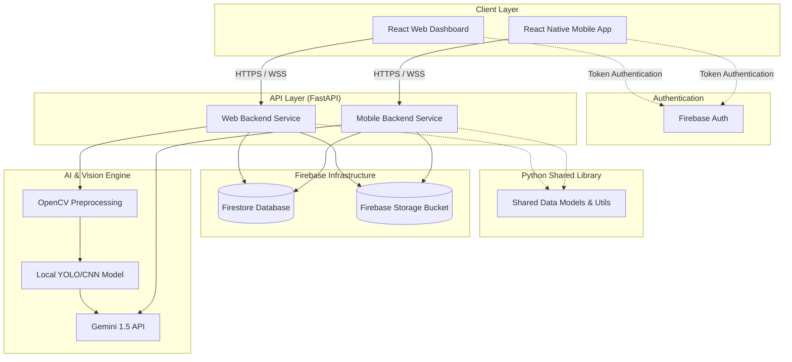

# RakshaNet: Architecture & Design Specification
Version: 2.0.0 (Updated Overhaul)

RakshaNet is an AI-powered Digital Public Safety Intelligence Platform designed to detect digital arrest scams, counterfeit currency, fraud networks, and cybercrime patterns using a hybrid approach combining traditional computer vision, local machine learning models, and large language models.

---

## 1. System Overview



### Architectural Decisions & Rationale
1. **Hybrid Banknote Analysis**: To establish a rigorous visual vetting pipeline suitable for forensics, raw images pass through **OpenCV Preprocessing** (noise removal, alignment, cropping) followed by a **local YOLO/CNN classification model** (deployed on the backend via ONNX Runtime) to yield a confidence rating and initial score. **Gemini API** is invoked next, consuming the scan and visual anomalies list to output descriptive reports.
2. **Audio Upload & Live Call Monitoring**: The platform supports a hybrid analyzer:
   * **Suspicious Call Analyzer**: Supports recorded call uploads (MP3/M4A), transcription, and offline evaluation.
   * **Live Call Listener**: Supports real-time call transcript evaluation streaming chunks via WebSockets.
3. **Storage vs. Database Separation**: Binaries (PDF, MP3, PNG) are routed directly to **Firebase Storage**. Firestore stores lean JSON documents carrying references (metadata, Storage paths, and signed download URLs).
4. **React Flow and Firestore Graphs**: Complex, heavy graph engines are replaced with a lightweight Firestore-based model. Relationships are represented as standard `fraud_nodes` and `fraud_edges` documents. The web frontend fetches these collections directly and binds them using **React Flow** for user visualization.
5. **Entity-Extraction Pipeline**: Post-report creation initiates a processing pipeline. Text transcripts are analyzed using regex and Gemini to extract identifiers (phone numbers, bank accounts, UPIs) and update the graph and heatmaps.

---

## 2. Core Components & Responsibilities

### Frontend - React Web Dashboard (`web-app`)
* **Technology**: React (Vite), Tailwind CSS, Lucide React, Recharts, React Flow, Leaflet.js.
* **Key Components**:
  * **Analyst Dashboard**: Platform telemetry overview.
  * **Counterfeit Currency Auditor**: Upload terminal to verify banknotes using the OpenCV + CNN backend pipeline and review Gemini's anomaly explanations.
  * **Fraud Network Canvas**: An interactive network canvas rendering nodes (`fraud_nodes`) and connections (`fraud_edges`) using **React Flow**.
  * **Geospatial Heatmap**: Map visualization displaying geographic zones of cybercrime reports.
  * **Evidence Manager**: View, seal, and download legally compliant PDF packets.

### Frontend - Mobile App (`mobile-app`)
* **Technology**: React Native (Expo), NativeWind, Expo AV (Audio recording), React Native Maps.
* **Key Screens**:
  * **Suspicious Call Recorder**: Interface to record ongoing citizen calls and upload them as audio files to Firebase Storage.
  * **Live Call Listener (Simulator)**: Displays real-time keyword alert notifications when suspicious call phrases are detected during call simulations.
  * **Quick Report & Geotag**: Instant button to report physical fraud locations with GPS coordinates.
  * **Evidence Collector**: Mobile utility to upload screenshots, audio snippets, or files.

### Web Backend (`web-backend`)
* **Technology**: FastAPI, Firebase Admin, PyTorch/ONNX (Banknote model), OpenCV, ReportLab.
* **Key Modules**:
  * `/currency`: Feeds uploaded image through OpenCV (gray, thresholding, crop), infers denomination and authenticity via YOLO/CNN ONNX model, and queries Gemini Flash to explain anomalies.
  * `/network`: Serves node and link documents from Firestore for React Flow rendering.
  * `/evidence`: Generates signed evidence PDFs, uploads them to Firebase Storage, hashes them (SHA-256), and registers them in Firestore.

### Mobile Backend (`mobile-backend`)
* **Technology**: FastAPI, Firebase Admin, Gemini API.
* **Key Modules**:
  * `/shield`: Implements WebSocket endpoint for streaming speech transcripts and `POST /shield/upload` for processing recorded call audio files.
  * `/geospatial`: Ingests report telemetry and logs geopoint structures in Firestore.

---

## 3. Storage & Database Schema

### 3.1. Firebase Storage Schema
Files are stored in the bucket under strict naming conventions:
* `audio/` -> Original recorded call audio files (`audio/REPORT_12345.mp3`).
* `screenshots/` -> User-uploaded screenshots of chats (`screenshots/REPORT_12345.png`).
* `currency/` -> Scanned banknote image files (`currency/SCAN_77777.png`).
* `evidence_pdfs/` -> Sealed forensic PDF packages (`evidence_pdfs/EVIDENCE_33333.pdf`).

---

### 3.2. Firestore Collection Schema

### Collection: `users`
```json
{
  "uid": "USER_12345",              // Match Firebase Auth UID
  "email": "officer.sharma@gov.in",
  "displayName": "Ramesh Sharma",
  "role": "analyst",                 // ["analyst", "police", "citizen"]
  "createdAt": "2026-06-24T12:00:00Z"
}
```

### Collection: `scam_reports`
```json
{
  "reportId": "REPORT_98765",
  "reporterUid": "USER_12345",
  "scamType": "digital_arrest",
  "threatActor": {
    "name": "CBI Officer Kumar",
    "phone": "+919876543210",
    "agencyClaimed": "CBI"
  },
  "audioStoragePath": "audio/REPORT_98765.mp3",       // Firebase Storage Path
  "audioUrl": "https://firebasestorage.googleapis.com/.../audio.mp3",
  "screenshotStoragePath": "screenshots/REPORT_98765.png",
  "screenshotUrl": "https://firebasestorage.googleapis.com/.../screenshot.png",
  "transcript": "You are under digital arrest. Do not disconnect the Skype call...",
  "riskAnalysis": {
    "score": 95.0,
    "riskLevel": "CRITICAL",
    "keyIdentifiers": ["skype_insistence", "cbi_claim"],
    "summary": "Threat actor impersonating CBI officer demanding Skype connection."
  },
  "location": {
    "geopoint": { "latitude": 28.6139, "longitude": 77.2090 },
    "city": "New Delhi",
    "state": "Delhi"
  },
  "status": "pending_investigation",
  "createdAt": "2026-06-24T12:10:00Z"
}
```

### Collection: `currency_scans`
```json
{
  "scanId": "SCAN_77777",
  "scannedBy": "USER_54321",
  "imageStoragePath": "currency/SCAN_77777.png",     // Firebase Storage Path
  "imageUrl": "https://firebasestorage.googleapis.com/.../note.png",
  "serialNumber": "4AB829103",
  "denomination": 500,
  "analysis": {
    "cvScore": 84.5,                                 // Local YOLO/CNN authenticity score (0-100)
    "isCounterfeit": true,
    "confidenceScore": 88.5,
    "anomaliesDetected": ["Missing watermark shift", "Bleeding edge Ashoka emblem"],
    "geminiRemarks": "Visual audit confirms printing errors in watermark region."
  },
  "createdAt": "2026-06-24T12:15:00Z"
}
```

### Collection: `fraud_nodes`
```json
{
  "id": "NODE_PHONE_919876543210",
  "type": "phone",                                   // ["phone", "bank_account", "suspect_identity", "upi_id"]
  "data": {
    "label": "+91 98765 43210",
    "riskScore": 90.0,
    "reportsAssociated": ["REPORT_98765"]
  },
  "position": { "x": 100, "y": 250 },                // Position coordinates for React Flow
  "createdAt": "2026-06-24T12:20:00Z"
}
```

### Collection: `fraud_edges`
```json
{
  "id": "EDGE_99999",
  "source": "NODE_PHONE_919876543210",
  "target": "NODE_BANK_123456789",
  "label": "instructs_payment_to",                    // React Flow link description
  "type": "smoothstep",                              // React Flow line drawer style
  "data": {
    "weight": 3.0,
    "lastObserved": "2026-06-24T12:20:00Z"
  }
}
```

### Collection: `evidence_packages`
```json
{
  "packageId": "EVIDENCE_33333",
  "associatedReports": ["REPORT_98765"],
  "generatedBy": "USER_12345",
  "pdfStoragePath": "evidence_pdfs/EVIDENCE_33333.pdf", // Firebase Storage Path
  "pdfUrl": "https://firebasestorage.googleapis.com/.../evidence_33333.pdf",
  "fileHash": "sha256-e3b0c44298fc1c149afbf4c8996fb92427ae41e4649b934ca495991b7852b855",
  "status": "sealed",
  "createdAt": "2026-06-24T12:30:00Z"
}
```

---

## 4. API Contracts

### 4.1. Mobile Backend API Contracts

#### POST `/api/v1/shield/upload`
Uploads a recorded call audio file to process offline.
* **Request Params**: Multipart Form
  * `audio`: Binary File (MP3/M4A)
  * `callerId`: string
* **Response Body (200 OK)**:
```json
{
  "reportId": "REPORT_98765",
  "transcript": "Hello, this is officer Subodh from CBI Delhi...",
  "riskScore": 95.0,
  "scamCategory": "digital_arrest",
  "recommendedAction": "BLOCK_NUMBER_AND_REPORT"
}
```

#### WebSocket `/api/v1/shield/stream`
Handles WebSocket connection for real-time speech token monitoring.
* **Client sends**: Audio chunk binaries (PCM/WAV)
* **Server returns**: JSON evaluation updates
```json
{
  "liveTranscript": "CBI Delhi calling. You must stay inside...",
  "warningFlag": true,
  "scamLikelihood": 85.0
}
```

---

### 4.2. Web Backend API Contracts

#### POST `/api/v1/currency/scan`
Uploads a banknote image file to run OpenCV and YOLO/CNN checks on the web-backend.
* **Request Params**: Multipart Form
  * `image`: Binary File (PNG/JPEG)
* **Response Body (200 OK)**:
```json
{
  "scanId": "SCAN_77777",
  "denomination": 500,
  "serialNumber": "4AB829103",
  "cvScore": 84.5,
  "isCounterfeit": true,
  "confidenceScore": 88.5,
  "anomalies": ["Watermark absent", "Security thread alignment error"],
  "explanation": "OpenCV visual edge checks found inconsistencies. Gemini audit verifies counterfeit properties."
}
```

#### GET `/api/v1/network/graph`
Returns nodes and edges directly formatted for React Flow imports.
* **Response Body (200 OK)**:
```json
{
  "nodes": [
    { "id": "NODE_PHONE_919876543210", "type": "default", "position": { "x": 100, "y": 250 }, "data": { "label": "+91 98765 43210" } }
  ],
  "edges": [
    { "id": "EDGE_99999", "source": "NODE_PHONE_919876543210", "target": "NODE_BANK_123456789", "label": "instructs_payment_to" }
  ]
}
```

---

## 5. Core Pipeline: Post-Ingestion Fraud Intelligence

When a citizen reports a scam (uploads call recording or screenshot), the backend runs a sequential pipeline to automatically expand the system intelligence:

```
[Complaint Ingestion]
        ↓
[Transcription Engine] ──> Store call recording in Firebase Storage
        ↓
[AI Scam Analysis] ──> Evaluate risk score & categorizations
        ↓
[Entity Extraction] ──> Match phone numbers, UPIs, bank accounts, identities
        ↓
[Graph Builder] ──> Write node/edge documents in firestore for React Flow
        ↓
[Geospatial Update] ──> Log latitude & longitude in crime_locations
        ↓
[Forensic Seal] ──> Generate PDF summary, sign hash, upload to Storage
```

1. **Transcription**: If audio is uploaded, Speech-to-Text converts speech to a string transcript. The audio binary is stored in Firebase Storage.
2. **Entity Extraction**: The web backend runs the transcript text through regex and Gemini models using the following system prompt:
   > You are an intelligence extractor. Extract any of the following items mentioned in the transcript text: Suspect names (identities), Spoofed phone numbers, Bank names and bank account numbers, UPI IDs, and Law agencies claimed (e.g. CBI, customs, cyber cell). Output a strict JSON structure containing lists for each category.
3. **Graph Builder**: For each extracted entity, the backend queries the `fraud_nodes` collection. If the node doesn't exist, it creates a new node document (generating an initial x/y position for React Flow rendering). It then writes matching link documents to `fraud_edges` (e.g. connecting the phone number to the target bank account).
4. **Geospatial updates**: If the reporter provided coordinates, a new coordinate log document is created in Firestore to update the heatmaps.
5. **Evidence Compilation**: A standard ReportLab script compiles these extracted entities, transcript, and risk levels into a PDF report file, uploads it to the `evidence_pdfs/` Firebase Storage bucket, and registers the file hash in Firestore.

---

## 6. Implementation Roadmap

```
Phase 1: Environment & Project Scaffolding
   |
Phase 2: Firebase Infrastructure (Auth, Firestore Collections, Storage Buckets)
   |
Phase 3: OpenCV & CNN/YOLO Backend Pipeline Integration (onnxruntime)
   |
Phase 4: Call Analyzer Audio Upload/WS Transcripts & Mobile Recorder Screen
   |
Phase 5: React Flow Network Dashboard, PDF Generation, & Geospatial Maps
   |
Phase 6: Verification, Tamper-Proof Hash Sealing, & End-to-End Auditing
```
